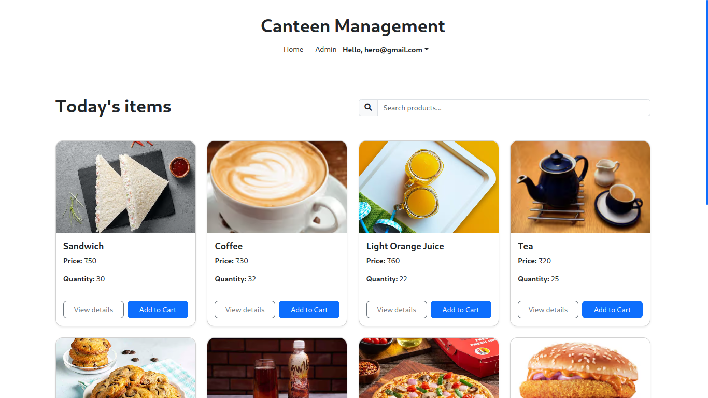
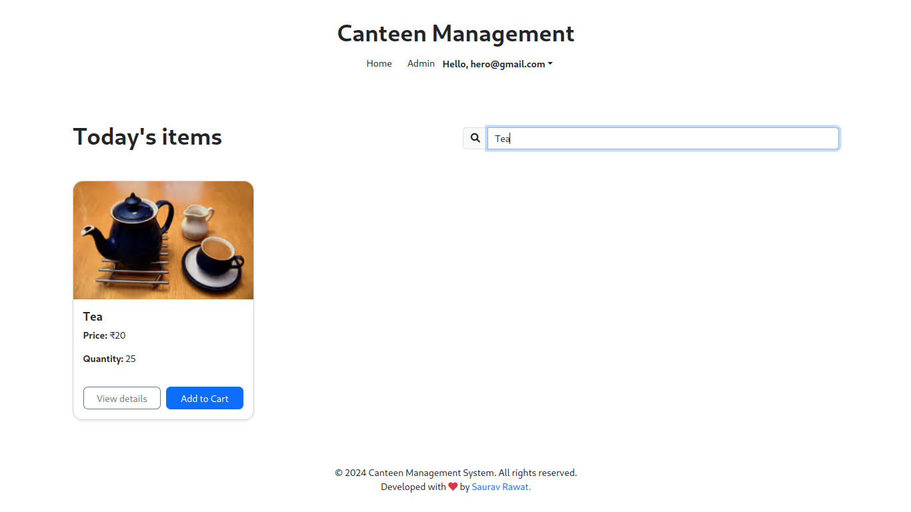
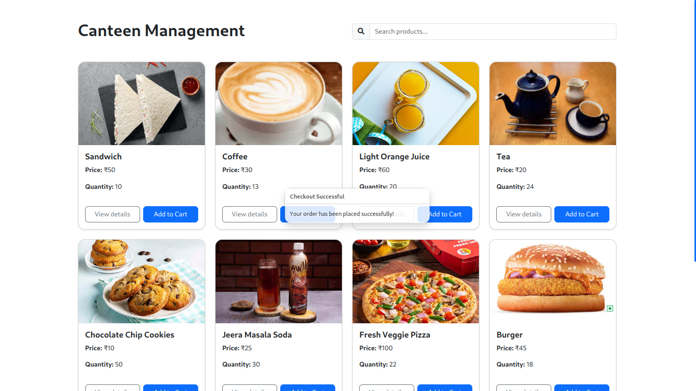

# Canteen Management System



## Overview

This Canteen Management System is a web-based application designed to streamline the process of ordering food items in a canteen or cafeteria setting. Built with React and Firebase, it offers a user-friendly interface for browsing products, adding items to a cart, and completing purchases.

**[Live Demo](https://sauravrwt.github.io/Canteen-Management/)**

## Features

- **Product Catalog**: Browse through a list of available food items with details such as name, price, and quantity.
- **Search Functionality**: Easily find products using the search bar.
- **Product Details**: View detailed information about each product by clicking on it.
- **Shopping Cart**: Add products to a cart, adjust quantities, and remove items as needed.
- **Checkout Process**: Complete purchases with a simple checkout process.
- **Real-time Updates**: Product quantities are updated in real-time using Firebase.
- **Responsive Design**: Works seamlessly on desktop and mobile devices.

## Technologies Used

- React.js
- Firebase (Realtime Database)
- Bootstrap 5
- React Bootstrap

## Installation and Setup

1. Clone the repository: `git clone https://github.com/SauRavRwT/canteen-management-system.git`

2. Navigate to the project directory: `cd canteen-management-system`

3. Install dependencies: `npm install`

4. Set up Firebase:
- Create a Firebase project at [https://console.firebase.google.com/](https://console.firebase.google.com/)
- Add a web app to your Firebase project
- Copy the Firebase configuration
- Create a `firebase.js` file in the root of your project and add your Firebase config:

  ```firebase.js
  apiKey: your_api_key
  authDomain: your_auth_domain
  databaseURL: your_databaseurl
  projectId: your_project_id
  storageBucket: your_storage_bucket
  messagingSenderId: your_messaging_sender_id
  appd: your_app_id
  ```

5. Start the development server: `npm start`

6. Open [http://localhost:3000](http://localhost:3000) to view it in the browser.

## Usage

- Browse through the product list on the main page.
- Use the search bar to find specific items.
- Click on a product to view more details.
- Add items to your cart.
- View your cart and adjust quantities as needed.
- Proceed to checkout to complete your order.

## Contributing

Contributions are welcome! Please feel free to submit a Pull Request.